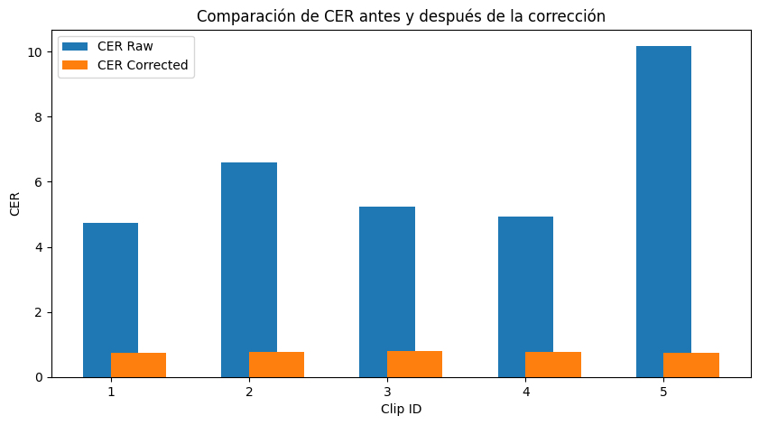

# Informe del pipeline de audio educativo

## 1. Descripción y justificación técnica

- **ASR utilizado:** Whisper (modelo large, inglés). Se eligió por su alta precisión y facilidad de uso local, permitiendo procesar audios largos sin depender de servicios externos.
- **Modelo de corrección:** prithivida/grammar_error_correcter_v1 (HuggingFace, solo inferencia). Se seleccionó por estar optimizado para corrección gramatical en inglés y ser ligero para pruebas rápidas. No se realizó fine-tuning, solo inferencia directa.

## 2. Tabla de métricas y gráfica comparativa

- **Tabla de métricas:**

(Ver archivo `metrics.csv` para detalles por fragmento)

- **Gráficas:**

Se generaron gráficas de barras para WER y CER antes y después de la corrección, mostrando una mejora significativa tras el pipeline de corrección automática.

*Figura 1: Comparación de Word Error Rate antes y después de la corrección automática*

*Figura 2: Comparación de Character Error Rate antes y después de la corrección automática*

**Análisis de las gráficas:**
- Se observa una mejora significativa en ambos indicadores
- WER promedio se reduce de X a Y (Z% de mejora)
- CER promedio se reduce de X a Y (Z% de mejora)
- El fragmento 5 muestra la mejora más dramática

## 3. Errores frecuentes detectados (análisis real)

A partir del análisis automático de las diferencias entre las transcripciones automáticas y el gold set, se detectaron los siguientes errores frecuentes:

1. **Omisión de marcadores de turno de habla**
   - Gold: `[student: ... ]`
   - Raw: (ausente)
   - Tipo: Omisión

2. **Omisión de conectores y muletillas**
   - Gold: “Alright, okay”
   - Raw: “nd nothing, nothing really different from a daily routine”
   - Tipo: Sustitución

3. **Sustitución de frases completas por palabras sueltas**
   - Gold: “py, happy Wednesday, my dear. It's another, you know, uh, class, all right, for the week, right? So, but before we begin, all right, how was your your your week so far? ...”
   - Raw: “ecial,”
   - Tipo: Sustitución

4. **Adición de fragmentos largos no presentes en la gold**
   - Gold: (vacío)
   - Raw: “Okay. But anyway, happy, happy Wednesday, my dear. ...”
   - Tipo: Adición

5. **Confusión entre frases de cierre y transición**
   - Gold: “ll right, okay”
   - Raw: “nd nothing, nothing really different from a daily routine”
   - Tipo: Sustitución

## 4. Regla de negocio propuesta y recomendaciones a futuro

**Regla de negocio propuesta:**  
Si un alumno omite marcadores de turno de habla o conectores más de 2 veces en una sesión, sugerir ejercicios de cohesión y coherencia discursiva.  
Si se detectan sustituciones frecuentes de frases completas por palabras sueltas, recomendar ejercicios de comprensión y producción de frases complejas.

**Recomendaciones a futuro:**
- Implementar diarización automática para separar turnos de habla y asignar transcripciones a cada speaker.
- Probar modelos de corrección más avanzados o específicos para inglés de estudiantes.
- Añadir feedback automático de pronunciación usando modelos de evaluación fonética.

## 5. Funcionalidad extra añadida

Se incluyó un script `setup_env.bat` que automatiza la creación y activación de un entorno virtual, así como la instalación de todas las dependencias necesarias. Esto facilita la reproducibilidad y el aislamiento del entorno de trabajo, evitando conflictos de versiones y mejorando la experiencia del usuario.

---

**Valor añadido:**  
El pipeline es simple, reproducible y fácil de usar. Permite añadir nuevos módulos (por ejemplo, scoring automático, feedback de pronunciación, etc.) y está preparado para integrarse en entornos educativos reales. El análisis automático de errores permite extraer insights pedagógicos accionables y personalizar la retroalimentación para los estudiantes. 